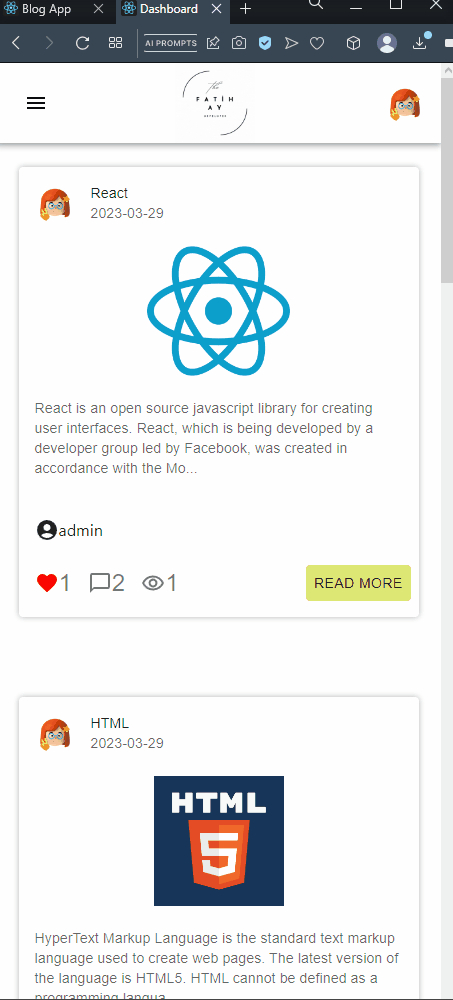

# Blog App
## Live Link: https://fatihay-blog-app.vercel.app/
## Description

Welcome to the Blog Application! This project provides a powerful platform for users to create and share their blog posts. With a user-friendly interface and a range of features, it allows writers and readers to connect in a dynamic and engaging way.
## Features
- <span style="font-size: larger;">**User Registration and Login**</span>: Seamlessly create an account or log in to access the application's full functionality.
- <span style="font-size: larger;">**Create and Publish Blog Posts**</span>: Share your thoughts, experiences, and expertise by composing and publishing engaging blog posts.
- <span style="font-size: larger;">**Interact and Engage**</span>: Allow readers to leave comments, engage in discussions, and share their opinions on blog posts.
- <span style="font-size: larger;">**User Profiles**</span>: Customize your profile, showcase your writing portfolio, and connect with fellow bloggers.
- <span style="font-size: larger;">**Like and Share**</span>: Enable readers to show their appreciation for captivating posts and share them across social media platforms.
- <span style="font-size: larger;">**Responsive Design**</span>: Enjoy a smooth and intuitive user experience on various devices, including desktops, tablets, and mobile phones.


## Project Skeleton
```
.
├── public
│   ├── favicon.ico
│   └── index.html
├── src
│   ├── App.css
│   ├── App.js
│   ├── app
│   │   └── store.jsx
│   ├── assets
│   │   ├── avatar.png
│   │   ├── loading1.gif
│   │   ├── login_img.svg
│   │   ├── logo.gif
│   │   ├── logo1.png
│   │   ├── register_img.svg
│   │   └── result.svg
│   ├── components
│   │   ├── Footer.jsx
│   │   ├── NavBar.jsx
│   │   ├── auth
│   │   │   ├── LoginForm.jsx
│   │   │   └── RegisterForm.jsx
│   │   └── blog
│   │       ├── BlogCard.jsx
│   │       ├── CommentForm.jsx
│   │       ├── DeleteModal.jsx
│   │       ├── NewBlogForm.jsx
│   │       └── UpdateModal.jsx
│   ├── features
│   │   ├── authSlice.jsx
│   │   └── blogSlice.jsx
│   ├── helper
│   │   └── ToastNotify.jsx
│   ├── hooks
│   │   ├── useAuthCalls.jsx
│   │   ├── useAxios.jsx
│   │   └── useBlogCalls.jsx
│   ├── index.css
│   ├── index.js
│   ├── pages
│   │   ├── About.jsx
│   │   ├── Dashboard.jsx
│   │   ├── Detail.jsx
│   │   ├── Login.jsx
│   │   ├── MyBlogs.jsx
│   │   ├── NewBlog.jsx
│   │   ├── NotFound.jsx
│   │   ├── Profile.jsx
│   │   └── Register.jsx
│   ├── router
│   │   ├── AppRouter.jsx
│   │   └── PrivateRouter.jsx
│   └── styles
│       └── globalStyle.jsx
├── README.md
├── blog-app.gif
├── package-lock.json
├── package.json
└── tailwind.config.js
```
## Expected Outcomes
<div >


</div>


## Technologies and Libraries
- <span style="font-size: larger;">**React.js**</span>: A powerful JavaScript library for building interactive user interfaces.
- <span style="font-size: larger;">**Redux**</span>: A predictable state management library for managing complex application states.
- <span style="font-size: larger;">**Axios**</span>: A popular HTTP client for making API requests and handling responses.
- <span style="font-size: larger;">**Tailwind CSS**</span>: A highly customizable CSS framework for creating stunning designs with minimal effort.
- <span style="font-size: larger;">**React Router**</span>: A popular routing library for React applications, allowing for dynamic and intuitive navigation between different pages within the application.
- <span style="font-size: larger;">**Custom Hooks**</span>: Custom hooks have been implemented to encapsulate reusable logic and improve code organization and reusability. These custom hooks include:

    - **useAuthCalls**: A custom hook that handles authentication-related API calls and state management.
    - **useAxios**: A custom hook that simplifies making HTTP requests using Axios and manages the loading and error states.
    - **useBlogCalls**: A custom hook that encapsulates the logic for making blog-related API calls and managing the blog-related states.

## Getting Started

To run the application on your local machine, follow these steps:

1. Clone the project to your computer:

   ```
   git clone https://github.com/iamfatihay/Blog-App.git
2. Open your terminal and navigate to the project directory.
   ```
   cd blog-app
3. Install the dependencies:
    ```
    npm install
4. Start the application:
    ```
    npm start
5. Open your web browser and visit  **http://localhost:3000**  to explore the Blog Application.

## Contribution
Welcome contributions to enhance the Blog Application! If you find any bugs or have ideas for improvements, please open an issue or submit a pull request. I appreciate your valuable input!

## License

The Blog Application is licensed under the [MIT License](LICENSE). Feel free to use, modify, and distribute the code as per the terms of the license.